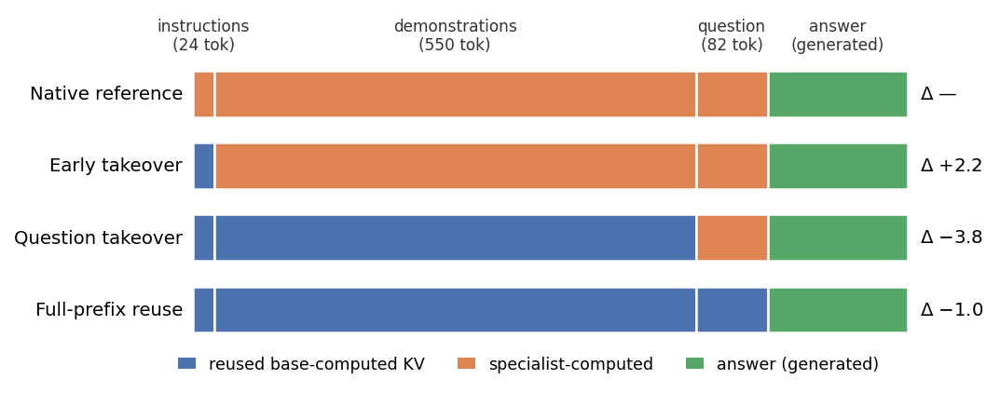
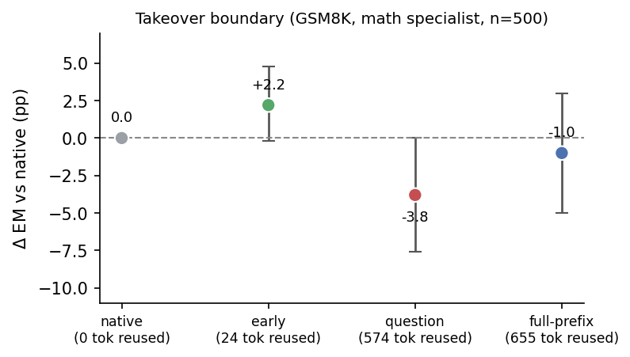
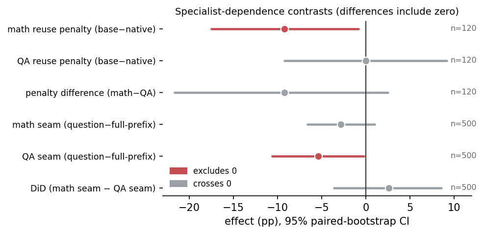

# RouteKV — Shared-Prefix KV Reuse Across Standard LoRA Adapters

[](paper/paper.pdf)


A composable small-model deployment runs **one shared backbone with several LoRA specialists** that answer
over the same context — the same retrieved passages, the same few-shot demonstrations. Served naïvely, that
shared context is re-prefilled once per specialist. This repository studies a narrow, practical question and
measures it carefully:

> **How much task quality does inference-time base-KV cache reuse preserve for _already-trained standard_
> LoRA adapters — without retraining for cache compatibility — and at what serving cost?**

Backbone: Qwen3-1.7B. Specialists: extractive QA (HotpotQA) and arithmetic reasoning (GSM8K). All metrics
are deterministic (F1, exact-match) with paired bootstrap 95% confidence intervals.

## How reuse works

We compute the shared prefix's KV cache once with the adapters disabled, then let a specialist take over at
a chosen boundary and generate. Sweeping that boundary — holding the full prompt and decoding fixed —
separates *how many tokens are reused* from *which content the specialist re-encodes*.



## What we find

Prefix reuse is a **quality–latency tradeoff**, measured on identical examples per setting with a base-only
baseline:

| setting | base-only | native | reuse | Δ reuse−native | warm-cache TTFT (nat→reuse) |
|---|---|---|---|---|---|
| GSM8K (EM, held-out n=500) | 8.4 | 54.4 | 49.8 | **−4.6 [−8.8,−0.4]** | 38→30 ms |
| QA 2K (F1, n=300) | 42.7 | 69.4 | 62.8 | **−6.6 [−10.5,−2.7]** | 96→30 ms |
| QA 8K (F1, n=200) | 43.3 | 72.5 | 67.9 | −4.5 [−9.3,+0.1] | **486→30 ms (≈16×)** |

- **The adapter is necessary** — base-only trails native by 46 EM (GSM8K) and 27–29 F1 (QA), under the tested decoding budget.
- **Reuse costs a small amount of quality**, and the QA penalty grows with context (+0.3 F1 at 700 tok → −6.6 at 2K). Part of the GSM8K gap is truncation: reuse hits the 160-token cap 30% vs native's 15%, and at a frozen 320-token budget the penalty shrinks from **−4.6 to −3.0 (CI includes zero)** — smaller and no longer significant, though still negative.
- **Warm-cache TTFT is the real win**, growing with context to ≈16× at 8K (base-prefix construction excluded and reported separately). A TTFT win does *not* imply a completion-latency win — reuse generates longer.

**Memory — the main correction to earlier drafts.** This implementation reuses KV *values* but **copies their
storage**: across two simultaneously-retained branches, peak memory was only 12% lower at 8K (5% at 2K) and
the prefix was **never physically shared** (0% of trials, before or after generation). Shared-cache memory
savings are *not* achieved and would need a paged cache.

Recomputing more of the prefix is **not** uniformly better (mechanism probe below), and there is **no
evidence the penalty is specialist-specific** — individual effects exclude zero, but the differences between
specialists include it.





A ridge KV translator did not beat direct reuse. This is a preliminary empirical report: single adapter seed
per task, one 1.7B backbone, and the truncation question is still open. See the paper's Limitations.

## Repository

```
paper/     paper.typ (Typst source), refs.bib, paper.pdf, figures/, make_figures.py
code/      training and evaluation harnesses
results/   per-example outcome arrays (npz) behind the n=500 boundary / specialist-dependence study
```

## Reproduce

```bash
pip install "torch>=2.11" "transformers==5.5" "peft==0.20" datasets numpy

# 1. train the two specialists (QA on HotpotQA, math on GSM8K; r16 a32, q/k/v/o)
python code/train_lora.py

# 2. quality: boundary sweep + specialist-dependence DiD over GSM8K test[80:580]
CUDA_VISIBLE_DEVICES=0 python code/confirm_did.py 0 250
CUDA_VISIBLE_DEVICES=1 python code/confirm_did.py 250 250
python code/merge_did.py

# 3. extractive QA reuse (supplied distractor context, truncated to 700 tokens)
python code/qa_eval_large.py

# 4. serving-cost accounting (prefill / cache)
python code/memory_accounting.py && python code/memory_audit.py
```

`results/did_shard_*.npz` hold the per-example arrays behind the paper's boundary and DiD numbers
(`numpy.load`; keys `math_native, math_early, math_question, math_full, qa_question, qa_full, golds`).

## Paper

`paper/paper.pdf` — *Shared-Prefix KV Reuse Across Standard LoRA Adapters: Quality and Serving Tradeoffs*
(AltSlate Labs, 2026). Compile with `typst compile paper/paper.typ`.
